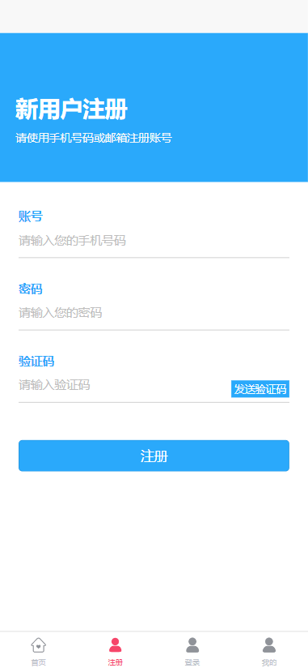

# uni-app-view-template

## 一、前言

该项目主要是从网上整理一些在开发uniapp时有可能会经常使用到的静态页面，为避免重复编写，减少项目开发时间，有需要的可以直接拿走，记得帮忙点个 `star` 啊！

## 二、项目介绍

包含的页面有：登录页面、注册页面、用户页面、首页

## 三、模板页面

### 登录页面

#### 模板一：

#### 2.模板二：

#### 3.模板三：

### 注册页面

#### 1.模板一：

#### 2.模板二：

### 用户页面

#### 1.模板一：

#### 2.模板二：

#### 3.模板三：

### 首页页面

#### 1.模板一：

### 商品列表页面

#### 1.模板一：

### 商品分类页面：

#### 1.模板一：

### 优惠卷页面

#### 1.模板一：

